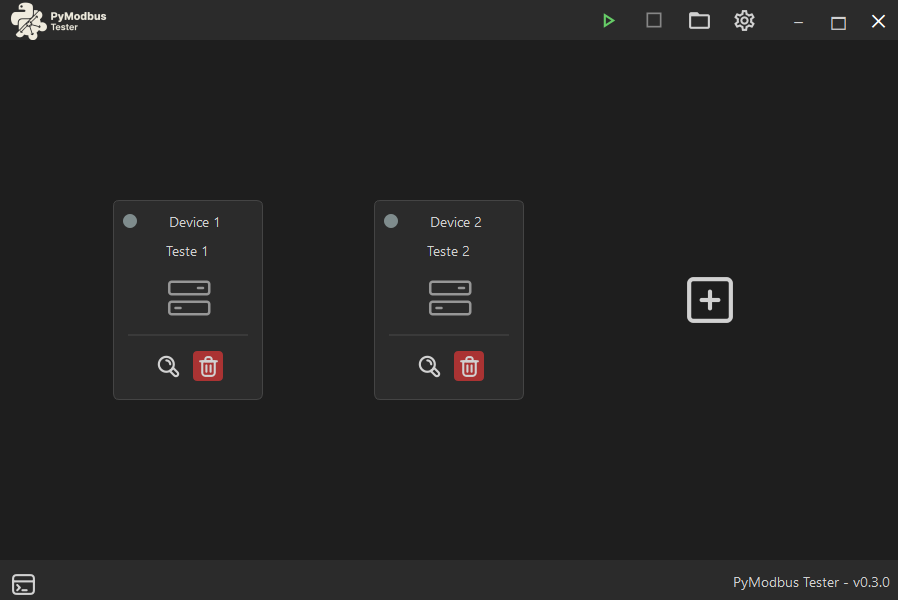
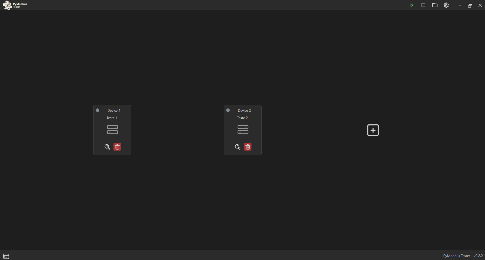
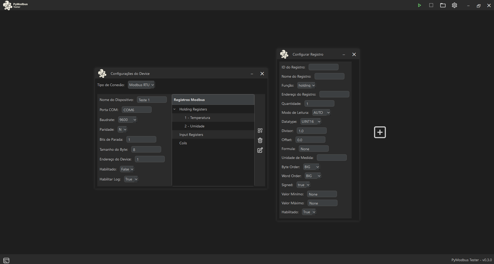
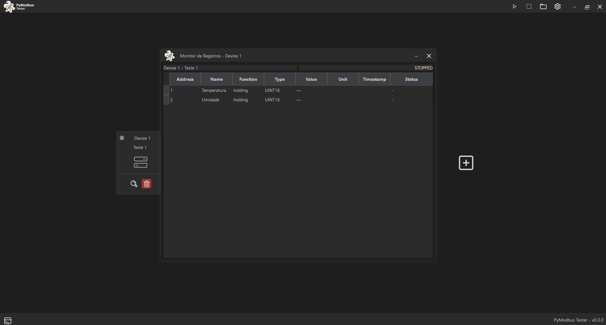

# PyModbus Tester




PyModbus Tester is a desktop application built with PySide6 and pymodbus for testing, monitoring, and simulating Modbus devices (RTU and TCP).

> ⚠️ Project under development – current version: v0.3.0

---

## 🚀 Features

- Support for **Modbus RTU and TCP**
- **Real-time register polling**
- **Device monitoring and status indication**
- **Basic auto-reconnect logic**
- **CSV logging system**
- **Modbus TCP simulator (for testing without hardware)**
- **Register visualization (Holding and Input)**
- Device configuration interface
- Organized tree view for registers
- Modular architecture

---

## 🏗️ Project Structure
```
pymodbus-tester/
│
├── icons/
├── images/
├── modbus/
│   ├── clients.py
│   ├── decoder.py
│   ├── errors.py
│   ├── poll_result.py
│   ├── reading.py
│   ├── poller.py
│   └── runtime.py
│
├── logger/
│   ├── connect_outputs.py
│   ├── csv_logger.py
│   └── logging_manager.py
│
├── models/
│   ├── device.py
│   ├── program_settings.py
│   └── registers.py
│
├── ui/
│   ├── base_window.py
│   ├── config_window.py
│   ├── console_window.py
│   ├── device_monitor_window.py
│   └── main_window.py
│ 
├── widgets/
│   └── status_indicator.py
│ 
├── config/
│   └── config_manager.py
│
├── core/
│   ├── custom_theme.py
│   └── utils.py
│
├── modbus_tcp_simulator/
│   └── modbus_tcp_simulator.py
│
├── main.py
│
├── README.md
├── requirements.txt
├── .gitignore
```

---

## 🧠 Architecture

The project is organized into modular layers:

- **UI Layer** → PySide6 interface and user interaction
- **Models Layer** → Device, register and configuration models
- **Modbus Layer** → Communication, polling and decoding logic
- **Core Layer** → Shared utilities, configuration and theming

---

## ⚙️ Requirements and Technologies

- Python 3.10+
- PySide6
- pymodbus
- asyncio
- dataclasses

Install dependencies:

```bash
pip install -r requirements.txt
```

---

## 📷 Application Preview

### 🖥️ Main Interface


### ⚙️ Device Configuration


### 📡 Device Monitor View


---

## 🧪 Modbus TCP Simulator

The project includes a built-in Modbus TCP simulator for testing without physical devices.
- Runs independently from the main application
- 
To run the simulator:

```bash
python modbus_tcp_simulator/simulator.py
```

This allows you to test the application in a fully virtual environment.


---

## 📊 CSV Logging

The application supports exporting register data to CSV files.

- Useful for data analysis
- Can be used for debugging and monitoring
- Structured output for external tools

---

## ▶️ Running the Application

```bash
python main.py
```
---

## 📌 Roadmap

- [ ] Improve async Modbus runtime
- [ ] Enhance reconnect strategies
- [ ] Add advanced logging system
- [ ] Export data improvements
- [ ] Standalone executable
- [ ] Installer build

---

## 👨‍💻 Author

Kauan Enzo (KalEzz)

---

## 📄 License

This project is open-source and available under the MIT License.

